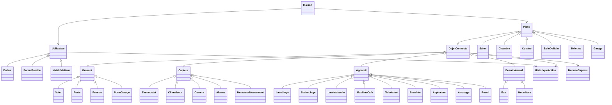

# CONTEXTE PROJET — Développement Web ING1 CY Tech
## Extrait complet de la session de travail

---

## 1. INFORMATIONS GÉNÉRALES

- **Cours** : Projet Développement Web ING1 2025-2026 — CY Tech Cergy
- **Profs** : Mariem Mahdi, Taisa Guidini Goncalves
- **Thème choisi** : Maison Intelligente
- **Repo GitHub** : https://github.com/cyZ-tech2/Dev-Web-ING-1-S2

---

## 2. STACK TECHNIQUE DÉCIDÉ

| Couche | Technologie |
|---|---|
| Frontend | React.js + Tailwind CSS |
| Backend | Spring Boot (Java) |
| BDD | MySQL |
| ORM | JPA / Hibernate |
| Versioning | Git / GitHub |

### Configuration Spring Boot (application.properties)
```properties
spring.datasource.url=jdbc:mysql://localhost:3306/maison_intelligente
spring.datasource.username=root
spring.datasource.password=
spring.jpa.hibernate.ddl-auto=update
spring.jpa.show-sql=true
```

---

## 3. MODULES DU PROJET (Administration supprimé par le prof)

| Module | Type utilisateur | Niveau requis | Accès |
|---|---|---|---|
| Information | Visiteur (non connecté) | — | Free tour, recherche (≥2 filtres), inscription |
| Visualisation | Simple | Débutant / Intermédiaire | Profil, objets/services, points |
| Gestion | Complexe | Avancé | CRUD objets, rapports, statistiques |

### Règle importante : Module Administration SUPPRIMÉ par le prof

---

## 4. SYSTÈME DE NIVEAUX ET POINTS

| Niveau | Type utilisateur | Module débloqué |
|---|---|---|
| Débutant | Simple | Visualisation |
| Intermédiaire | Simple | Visualisation |
| Avancé | Complexe | Gestion |
| Expert | (Admin supprimé) | — |

### Points
- Connexion : 0.25 pts
- Consultation d'un objet/service : 0.50 pts
- Seuils à définir par le groupe

### Règle niveauMax par type de membre
- **Enfant** → niveauMax = Intermédiaire (pas accès Gestion)
- **ParentFamille** → niveauMax = Avancé
- **VoisinVisiteur** → niveauMax = Débutant

---

## 5. TYPES D'UTILISATEURS

```
Utilisateur (classe parent)
├── Enfant        → niveauMax = Intermédiaire
├── ParentFamille → niveauMax = Avancé
└── VoisinVisiteur → niveauMax = Débutant
```

### Attributs Utilisateur
- id, nom, prenom, login, motDePasse, email
- niveau (enum : débutant/intermédiaire/avancé)
- niveauMax (enum)
- points (float)
- photo, nbConnexions, nbActions

### Partie publique profil
- Pseudonyme, Age, Sexe/Genre, DateNaissance, TypeMembre, Photo

### Partie privée profil (user + admin seulement)
- Nom, Prénom, MotDePasse

---

## 6. PIÈCES DE LA MAISON

```
Piece (classe abstraite)
├── Salon
├── Chambre
├── Cuisine
├── SalleDeBain
├── Toilettes
└── Garage
```

---

## 7. OBJETS CONNECTÉS — HIÉRARCHIE UML COMPLÈTE

```
ObjetConnecte (abstraite)
│
├── Ouvrant (abstraite)
│   ├── Volet
│   ├── Porte
│   ├── Fenetre
│   └── PorteGarage
│
├── Capteur (abstraite)
│   ├── Thermostat
│   ├── Climatiseur
│   ├── Camera
│   ├── Alarme
│   └── DetecteurMouvement
│
├── Appareil (abstraite)
│   ├── LaveLinge
│   ├── SecheLinge
│   ├── LaveVaisselle
│   ├── MachineCafe
│   ├── Television
│   ├── Enceinte
│   ├── Aspirateur
│   ├── Arrosage
│   └── Reveil
│
└── BesoinAnimal (abstraite)
    ├── Eau
    └── Nourriture
```

### Attributs communs ObjetConnecte
- id, nom, marque, etat (actif/inactif), connectivite (WiFi/Bluetooth)
- batterie (float %), derniereInteraction (DateTime)
- piece_id (FK → Piece)

### Méthodes communes
- activer(), desactiver(), getInfos()

### Attributs et méthodes par groupe

**Ouvrant**
- position (int %)
- ouvrir(), fermer(), setPosition(int)

**Capteur**
- zone, derniereAlerte (DateTime)
- lire() float, alerter() void
- Thermostat : tempActuelle, tempCible, mode → setTemperature(float), chauffer()
- Climatiseur : vitesse → setVitesse(String)
- Camera : resolution → voirFlux()
- Alarme : tester()
- DetecteurMouvement : detecter() boolean

**Appareil**
- cycle, consoEnergie (float)
- demarrer(), arreter()
- LaveLinge : consoEau, dureeRestante → setCycle(String)
- MachineCafe : niveauEau → programmer(String)
- Television : volume, chaine → setChaine(String)
- Enceinte : volume, source → setSource(String)
- Aspirateur : zoneNettoyage
- Arrosage : duree, zone
- Reveil : heureAlarm, son → programmer(String)

**BesoinAnimal**
- niveau (float), animal (String)
- verifierNiveau() void
- Eau : capacite → remplir()
- Nourriture : stock, portion → distribuer(), programmer(String)

---

## 8. CLASSES DE TRAÇABILITÉ

### HistoriqueAction
- id, action (String), timestamp (DateTime), resultat (String)
- Lié à : Utilisateur (FK), ObjetConnecte (FK)
- Justification cahier des charges : "Gérer le nombre d'actions faites par les utilisateurs" (p.6), "Accéder aux historiques des données des objets connectés" (p.8)

### DonneeCapteur
- id, valeur (float), unite (String), timestamp (DateTime)
- Lié à : ObjetConnecte (FK)
- Justification : "vous devez avoir assez de données pour chaque objet connecté" (p.3)

---

## 9. RELATIONS UML

```
Maison "1" --> "*" Piece : contient
Maison "1" --> "*" Utilisateur : regroupe
Piece "1" --> "*" ObjetConnecte : héberge
Utilisateur "1" --> "*" HistoriqueAction : effectue
ObjetConnecte "1" --> "*" HistoriqueAction : concernePar
ObjetConnecte "1" --> "*" DonneeCapteur : génère
```

---

## 10. CODE MERMAID DU DIAGRAMME UML



---

## 11. ATTENDUS DU PROJET (cahier des charges)

| Livrable | Détail |
|---|---|
| Rapport | 15 pages max — intro, Gantt, étapes, conclusion |
| Soutenance | 20 min — démo en direct |
| Git | Commits réguliers, structure de dossiers |
| BDD | MySQL peuplée avec générateur de données |
| Frameworks | Obligatoires (pas de CMS) |
| Responsive | Obligatoire + WCAG |

---

## 12. DÉCISIONS PRISES EN GROUPE

- ✅ Thème : Maison intelligente
- ✅ Stack : React + Spring Boot + MySQL
- ✅ Module Administration supprimé
- ✅ Outil UML : Lucidchart (collaboration temps réel)
- ✅ Classes intermédiaires abstraites gardées (Ouvrant, Capteur, Appareil, BesoinAnimal)
- ✅ Volets → groupe Ouvrant (avec portes/garage/fenêtres)
- ✅ niveauMax par type de membre (Enfant limité)
- ✅ Réveil ajouté dans Appareil
- ⏳ Seuils de points à définir

---

## 13. CE QUI RESTE À FAIRE

1. Finaliser et valider le diagramme UML sur Lucidchart
2. Définir les seuils de points pour chaque niveau
3. Générer le script SQL MySQL depuis l'UML
4. Coder le backend Spring Boot (entités JPA + API REST)
5. Coder le frontend React (pages par module)
6. Rédiger le rapport
7. Préparer la soutenance

---

