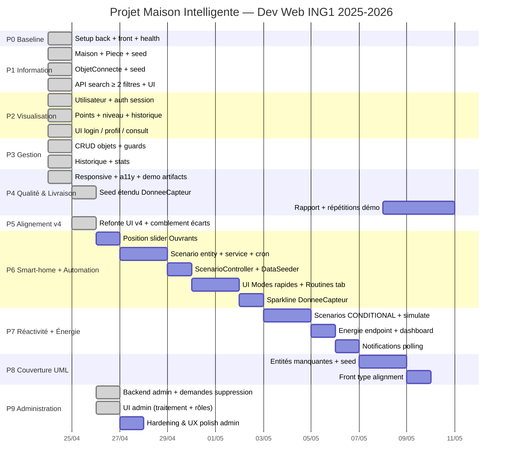

# PLAN.md — Maison Intelligente (Dev Web ING1)

Plan d'exécution MVP. Complément de [NEXT_TASKS.md](NEXT_TASKS.md) (backlog roulant) et [DECISIONS.md](DECISIONS.md) (décisions figées).

## Objectif

Livrer une démo fonctionnelle des modules **Information / Visualisation / Gestion / Administration** + rapport + soutenance, dans l'ordre MVP imposé, avec un Gantt réutilisable dans le rapport.

> Historique scope : Administration était initialement exclue (correction prof), puis **réintégrée sur décision équipe/utilisateur le 2026-04-26** pour faire le projet complet.

## Règles de travail

- Chaque tâche ≤ 2h et a une **Definition of Done (DoD)** testable (curl ou navigateur).
- Un commit par tâche DoD-verte. Pas de WIP sur `main`.
- Mise à jour de [WORKLOG.md](WORKLOG.md) après chaque tâche verte.
- Pas de sur-ingénierie : pas de JWT si session suffit, pas de Tailwind avant P4 si CSS de base suffit, pas d'abstraction prématurée.
- La coordination du projet se fait via [WORKLOG.md](WORKLOG.md) + [NEXT_TASKS.md](NEXT_TASKS.md).

## Jalons

| ID | Jalon | Contenu | Statut |
|----|-------|---------|--------|
| M0 | Baseline Green | Back + Front démarrent, `/api/health` OK | done 2026-04-24 |
| M1 | Information publique | Home + recherche ≥ 2 filtres | done 2026-04-24 |
| M2 | Visualisation | Auth + profil + consult + points | done 2026-04-24 |
| M3 | Gestion | CRUD objets + stats + historique | done 2026-04-24 |
| M4 | Qualité & Livraison | Tailwind + responsive + WCAG + MySQL + rapport | done 2026-04-24 |
| M5 | Alignement v4 | Refonte UI v4 + comblement écarts (P5) | done 2026-04-25 |
| M6 | Smart-home + Automation | Position contrôle + scénarios programmés/manuels (P6) | done 2026-04-26 |
| M7 | Réactivité + Énergie | Triggers conditionnels + dashboard conso + notifications (P7) | done 2026-04-26 |
| M8 | Couverture UML | Tous les types feuille créables côté back/front (P8) | done 2026-04-26 |
| M9 | Administration | Gouvernance utilisateurs + demandes suppression + audit admin (P9) | done 2026-04-26 |

## Ordre d'implémentation des entités JPA

Ordre = couche la plus basse d'abord, pour que chaque entité ait déjà ses dépendances.

1. **Maison** (racine, sans parent) → 1 seule instance en pratique.
2. **Piece** (abstraite) + 6 concrètes `Salon / Chambre / Cuisine / SalleDeBain / Toilettes / Garage` → FK vers Maison.
3. **Utilisateur** (abstrait) + 3 concrets `Enfant / ParentFamille / VoisinVisiteur`. Enums : `Niveau`, `NiveauMax`, `TypeMembre`.
4. **ObjetConnecte** (abstrait) + 4 branches abstraites (`Ouvrant / Capteur / Appareil / BesoinAnimal`) + feuilles (`Volet`, `Porte`, `Thermostat`, `LaveLinge`, ...). FK vers Piece.
5. **HistoriqueAction** → FK Utilisateur + FK ObjetConnecte.
6. **DonneeCapteur** → FK ObjetConnecte (sémantiquement lié au sous-arbre Capteur, mais FK simple suffit pour MVP).

### Stratégie JPA d'héritage (proposition)

- `Piece`, `Utilisateur`, `ObjetConnecte` : **`InheritanceType.SINGLE_TABLE` + `@DiscriminatorColumn`**.
- Avantages : un seul SELECT pour les listings (module Information), code simple, perf OK au volume démo.
- Changement possible plus tard sans casser l'API REST.

## P1 — Module Information (public, pas d'auth)

**Objectif** : un visiteur peut consulter la maison et chercher des objets/pièces avec **≥ 2 filtres**.

### Backend
- [ ] **P1.1** Entités `Maison` + `Piece` + `PieceRepository` + seed 1 maison / 6 pièces — *DoD : `GET /api/info/pieces` renvoie 6 pièces.*
- [ ] **P1.2** Entités `ObjetConnecte` et sous-types (au moins 2 feuilles par branche pour démarrer) + seed ≥ 12 objets répartis — *DoD : `GET /api/info/objets` renvoie ≥ 12 items.*
- [ ] **P1.3** `InfoController.GET /api/info/objets?type=X&pieceId=Y&q=Z` (filtres combinables, tous optionnels) — *DoD : 3 requêtes curl distinctes renvoient des sous-ensembles cohérents.*
- [ ] **P1.4** DTOs de sortie (éviter sérialisation circulaire FK).

### Frontend
- [ ] **P1.5** Install `react-router-dom` + layout (Header / Main / Footer).
- [ ] **P1.6** Page `/` publique (présentation + CTA "Découvrir").
- [ ] **P1.7** Page `/recherche` : 3 filtres (type, pièce, mot-clé) + liste résultats — *DoD : combiner 2 filtres restreint la liste côté UI, debounce sur le texte.*

## P2 — Module Visualisation (membre connecté)

**Objectif** : un membre se connecte, voit son profil, consulte objets/services, ses actions alimentent points + niveau.

### Backend
- [ ] **P2.1** Hiérarchie `Utilisateur` + enums + `UtilisateurRepository` + seed 3–5 users test.
- [ ] **P2.2** Auth **session Spring Security** (cookie stateful) — pas de JWT (décision MVP, cf. Risques).
- [ ] **P2.3** `POST /api/auth/register`, `POST /api/auth/login`, `POST /api/auth/logout`, `GET /api/me`.
- [ ] **P2.4** Entité `HistoriqueAction` + service `PointsService.record(user, action)`.
- [ ] **P2.5** Règles :
  - login → +0.25 pts
  - consult → +0.50 pts
  - recalcul niveau après chaque action, clampé à `niveauMax` du type de membre
- [ ] **P2.6** `GET /api/visu/objets` (mêmes filtres que P1) + `GET /api/visu/objets/:id` qui **incrémente** l'historique.

### Frontend
- [ ] **P2.7** Pages `/login` et `/register`.
- [ ] **P2.8** Contexte Auth React + route guard (redirige non-connectés).
- [ ] **P2.9** Page `/profil` (champs publics + privés, nbConnexions, points, niveau, barre progression).
- [ ] **P2.10** Page `/objets/:id` → consulte backend (qui ajoute +0.50 et log).
- [ ] **P2.11** Badge niveau + compteur points dans le header.

## P3 — Module Gestion (réservé niveau Avancé)

**Objectif** : un parent (niveau Avancé) gère les objets, voit historique + stats.

### Backend
- [ ] **P3.1** Garde d'accès : seuls les utilisateurs avec `niveau == AVANCE` accèdent à `/api/gestion/**`.
- [ ] **P3.2** CRUD `ObjetConnecte` : `POST / PUT / DELETE /api/gestion/objets` avec un champ `type` sur le body (factory côté service pour instancier la bonne feuille).
- [ ] **P3.3** `PATCH /api/gestion/objets/:id/piece` (changement de pièce).
- [ ] **P3.4** `POST /api/gestion/objets/:id/activer` et `/desactiver` (logué dans `HistoriqueAction`).
- [ ] **P3.5** `GET /api/gestion/stats` (nb objets par pièce, nb actions 7 derniers jours) + `GET /api/gestion/historique?userId=?&objetId=?&from=?`.

### Frontend
- [ ] **P3.6** Page `/gestion/objets` (liste + actions inline activer/désactiver/supprimer).
- [ ] **P3.7** Formulaire create/edit objet (select type, marque, pièce, etc.).
- [ ] **P3.8** Page `/gestion/historique` (table filtrable).
- [ ] **P3.9** Page `/gestion/stats` (2–3 cartes + 1 graphique simple — lib `recharts`).

## P4 — Qualité & Livraison

- [x] **P4.1** Install Tailwind + passe visuelle (bouton/form/card unifiés). *(Tailwind installé mais le shell v4 utilise CSS vars + inline styles — les directives Tailwind dans `index.css` sont à nettoyer plus tard.)*
- [x] **P4.2** Responsive pass sur 320 / 768 / 1280 px.
- [x] **P4.3** Accessibilité (labels form, contraste ≥ AA, navigation clavier, `aria-live` sur health, skip link).
- [x] **P4.4** Seed étendu : 12 objets, ~63 `DonneeCapteur` sur 7 jours, 5+ entrées `HistoriqueAction`, 3 users démo.
- [ ] **P4.5** Swap H2 → MySQL (décommenter `pom.xml` + bascule `application.properties`, déjà prêts). *Reporté : H2 reste l'option zéro-config jusqu'au déploiement.*
- [ ] **P4.6** Rédaction rapport (15 p max) : intro, Gantt (recycler celui d'ici), étapes, conclusion.
- [ ] **P4.7** 2 répétitions de démo chronométrées (soutenance = 20 min).

## P5 — Alignement v4 + comblement écarts (done 2026-04-25)

**Objectif** : raccrocher le shell v4 livré côté UI à toutes les API et corriger les éléments décoratifs/morts.

- [x] **P5.1** Taxonomie UML centralisée côté front (`TYPE_TAXONOMY` : 20 types → branche/service/icône/méthodes).
- [x] **P5.2** Seuils niveau alignés sur backend (0/3/10), suppression du faux niveau `Expert`.
- [x] **P5.3** HomePage : boutons `Alertes` et `Nouvel objet` câblés (panneau alertes + redirection Gestion + ouverture form).
- [x] **P5.4** HouseMap : rendu dynamique de toutes les pièces renvoyées par `/api/info/pieces` (6/6).
- [x] **P5.5** DetailDrawer : historique réel via `/api/gestion/historique` filtré par `objetId`.
- [x] **P5.6** DetailDrawer : méthodes UML actionnables (`ouvrir/fermer/demarrer/arreter/remplir/distribuer`) câblées sur `PATCH /etat`.
- [x] **P5.7** Visualisation : filtre `pieceId` ajouté.
- [x] **P5.8** Gestion : carte "Répartition par service" (utilise `stats.parService`).
- [x] **P5.9** Suppression des stubs `Tweak*` morts dans le shell + nettoyage a11y.
- [x] **P5.10** Fix du bug d'effet infini dans `VisualisationPage` (dep `user` → `user?.id`, suppression de `onSessionRefresh` du chemin de chargement).

## P6 — Contrôle réel + moteur d'automation (headline)

**Objectif** : transformer le CRUD en vrai produit smart-home. Volet à 50%, scénario "Bonjour" qui ouvre tout à 8h, bouton "Cinéma" qui ferme tout en un clic.

### Backend
- [ ] **P6.1** `Ouvrant.position` mis à jour via `PUT /api/gestion/objets/{id}` *(champ déjà persisté, valider la mise à jour partielle).* — DoD : `curl -X PUT … -d '{"position":50}'` → GET le confirme.
- [ ] **P6.2** Entité `Scenario` (id, nom, description, icon, type=`MANUAL/SCHEDULED/CONDITIONAL`, cron string nullable, enabled bool, dateCreation, derniereExecution).
- [ ] **P6.3** Entité `ScenarioAction` (FK scenario, FK objetConnecte, targetEtat, targetPosition).
- [ ] **P6.4** `ScenarioRepository` + `ScenarioActionRepository`.
- [ ] **P6.5** `ScenarioService.run(scenario, utilisateur)` : applique chaque action, persiste `derniereExecution`, log `HistoriqueAction` avec nouveau `ActionType.SCENARIO_RUN` (+1.5 pts).
- [ ] **P6.6** `@EnableScheduling` + `ScenarioScheduler.tick()` `@Scheduled(cron="0 * * * * *")` qui parse `cron` via `org.springframework.scheduling.support.CronExpression`, exécute si match.
- [ ] **P6.7** `ScenarioController` (`GET / POST / PUT / PATCH enabled / DELETE / POST run`).
- [ ] **P6.8** `GET /api/gestion/objets/{id}/donnees?since=…` : renvoie les `DonneeCapteur` pour visualiser.
- [ ] **P6.9** `DataSeeder` : 4 scénarios pré-créés (Bonjour ☀ / Bonsoir 🌙 / Cinéma 🎬 / Sécurité 🔒).
- [ ] **P6.10** `ActionType.SCENARIO_RUN` ajouté à l'enum + reconnu côté UI historique.

### Frontend
- [ ] **P6.11** Slider position 0–100 % dans `DetailDrawer` (Ouvrants) + bouton "Appliquer" → `PUT /objets/{id}`.
- [ ] **P6.12** Slider/input position dans le formulaire de Gestion (création/édition).
- [ ] **P6.13** Sparkline SVG inline des dernières mesures `DonneeCapteur` dans `DetailDrawer` (Capteurs uniquement).
- [ ] **P6.14** Boutons "Modes rapides" sur HomePage (`Bonjour / Bonsoir / Cinéma / Sécurité`) → `POST /scenarios/{id}/run` → toast + KPIs rafraîchis.
- [ ] **P6.15** Section "Routines" dans GestionPage : liste, switch enabled, lancer, edit, delete + formulaire create/edit (cron picker presets, multi-select objets cible avec target etat/position).

### DoD globale
Login parent → Home → clic "Bonjour" → 4 objets changent visiblement en <1s → toast + entrée `SCENARIO_RUN` dans l'historique. Backend tournant à 22h00 un jour de semaine → `Bonsoir` se déclenche tout seul, sans clic.

## P7 — Automation réactive + énergie + notifications

**Objectif** : la maison réagit aux événements (mouvement, batterie, température) + dashboard énergétique pour le rapport.

### Backend
- [x] **P7.1** Étendre `Scenario.type` avec `CONDITIONAL` + champs `triggerObjetId` + `triggerEvent` (`MOTION_DETECTED`, `BATTERY_LOW`, `TEMP_BELOW`).
- [x] **P7.2** `POST /api/gestion/objets/{id}/simulate-event` `{ event }` (faute de vrais capteurs, bouton démo).
- [x] **P7.3** Évaluation contextuelle naïve : `night` = heure ∈ [20:00, 07:00], `day` = sinon, `temp<X` lit la dernière `DonneeCapteur`. Stockée en string libre dans `Scenario.condition`.
- [x] **P7.4** `GET /api/gestion/energie` → `{ consoTotaleKwh, parPiece[], topConsommateurs[] }`.
- [ ] **P7.5** `GET /api/gestion/notifications?since=…` (poll) : agrège scénarios récemment exécutés, alertes batterie, événements simulés.

### Frontend
- [x] **P7.6** Bouton "Simuler événement" dans `DetailDrawer` (Camera / DetecteurMouvement) → POST → scénario lié visible immédiatement.
- [x] **P7.7** Carte "Consommation" sur HomePage + section détaillée dans Gestion (top 3 consommateurs, barre par pièce).
- [x] **P7.8** Slider de température cible pour Thermostat dans `DetailDrawer` (PUT `/objets/{id}` avec `tempCible`).
- [x] **P7.9** Toasts in-app via polling 30s sur `/notifications`.

## P8 — Élargissement UML backend (volume mécanique)

**Objectif** : couvrir tous les types feuille de l'UML pour atteindre la note maximum sur la couverture du diagramme.

- [x] **P8.1** Entités manquantes : `Fenetre`, `PorteGarage`, `Climatiseur`, `Alarme`, `DetecteurMouvement`, `MachineCafe`, `Enceinte`, `Aspirateur`, `Arrosage`, `Reveil`, `SecheLinge`, `LaveVaisselle`.
- [x] **P8.2** `GestionController#buildByType` étendu pour chaque nouveau type.
- [x] **P8.3** `GESTION_TYPE_OPTIONS` côté front aligné.
- [x] **P8.4** `GET /api/gestion/historique?objetId={id}` (filtrage côté serveur, le front filtre actuellement en mémoire).
- [x] **P8.5** `DataSeeder` : 1 instance par nouveau type (utile pour P6 "Sécurité" avec une vraie Alarme).

## P9 — Administration (réintégré 2026-04-26)

**Objectif** : ajouter une couche de gouvernance complète (admin) sans casser la progression membre.

### Backend
- [x] **P9.1** Flag `admin` sur `Utilisateur` + exposition dans `UserProfileDTO`.
- [x] **P9.2** Guard `SessionUtilisateurService.requireAdmin(HttpSession)`.
- [x] **P9.3** Entité `DemandeSuppression` + statut (`PENDING/APPROVED/REJECTED`) + repository.
- [x] **P9.4** User flow : `POST /api/gestion/objets/{id}/demande-suppression` + `GET /api/gestion/demandes-suppression/mes-demandes`.
- [x] **P9.5** Admin flow :
  - `GET /api/admin/utilisateurs`
  - `PATCH /api/admin/utilisateurs/{id}/admin`
  - `GET /api/admin/demandes-suppression`
  - `POST /api/admin/demandes-suppression/{id}/decision`
- [x] **P9.6** Hardening policy : empêcher un seul admin de se désactiver si c'est le dernier admin actif.

### Frontend
- [x] **P9.7** Onglet `Administration` visible uniquement si `user.admin === true`.
- [x] **P9.8** Écran admin : traitement demandes suppression (approve/reject) + toggle admin utilisateurs.
- [x] **P9.9** Gestion côté non-admin : bouton suppression converti en **demande** au lieu de delete direct.
- [x] **P9.10** UX polish admin : filtres (pending only), compteur pending, tri/cherche utilisateur.

### DoD globale
- Compte `admin@demo.local` voit l'onglet Administration et peut traiter les demandes.
- Compte non-admin ne peut pas appeler `/api/admin/**` (403).
- Suppression demandée par un non-admin devient visible côté admin et traitable.

## Décisions en attente (à figer en groupe)

| Sujet | Proposition par défaut | Statut |
|-------|------------------------|--------|
| Seuils points | 0–3 Débutant / 3–10 Intermédiaire / ≥ 10 Avancé | figé (cf. `Niveau.fromPoints`) |
| Scope Administration | Réintégré (module admin complet visé) | figé le 2026-04-26 |
| Stratégie JPA héritage | SINGLE_TABLE partout | figé |
| Auth | Session Spring Security (pas JWT) | figé (cookie HTTP via `SessionUtilisateurService`) |
| Moment Tailwind | Installer au P4 | partiellement appliqué — shell v4 utilise CSS vars, Tailwind résiduel à nettoyer |
| Moment MySQL | Swap à la fin P2 | reporté — H2 conservé tant que pas de déploiement durable |
| Feuilles ObjetConnecte à implémenter au MVP | 2–3 par branche | à étendre via P8 |
| Moteur scénarios — cron parsing | `org.springframework.scheduling.support.CronExpression` (déjà dans Spring, pas de Quartz) | à valider |
| Trigger conditionnel | Pas de capteur réel → bouton "simuler événement" + évaluation `night/day` côté serveur | à valider |
| Persistence des scénarios | Table `scenario` + table `scenario_action` (FK obj), pas de JSON sérialisé | à valider |

Quand une décision est figée, la déplacer dans [DECISIONS.md](DECISIONS.md).

## Risques & mitigations

1. **Volume d'entités** (~35 feuilles si tout est implémenté). → Commencer avec 2–3 feuilles par branche, ajouter au seed si temps. **Mitigation** : P8 isolé pour ne pas bloquer le reste.
2. **Auth Spring Security chronophage**. → Session cookie stateful, pas de JWT, pas d'OAuth.
3. **UI incohérente sans framework CSS**. → Structure sémantique HTML propre dès P1, unification Tailwind en P4. **État** : finalement, shell v4 utilise CSS vars → Tailwind reste résiduel.
4. **Swap MySQL casse quelque chose**. → H2 déjà en `MODE=MySQL`, scripts de migration testés avant la bascule.
5. **Dérive temporelle sur le rapport**. → Tenir le Gantt ci-dessous, l'intégrer progressivement dans le rapport (pas de big-bang final).
6. **Scheduler Spring déclenche pendant les tests/dev**. → `ScenarioScheduler` skip si `scenario.enabled=false`. Fournir un toggle global `app.scheduler.enabled=false` pour les tests/CI. Tracer chaque exécution dans `HistoriqueAction` pour auditabilité.
7. **Concurrence sur l'exécution d'un scénario** (cron qui se chevauche). → Verrouillage applicatif simple (`synchronized` sur l'id de scénario) ou `@Transactional` + check de `derniereExecution` au début. Volume démo négligeable, pas besoin de Redis lock.
8. **Drift d'horloge serveur vs front pour la démo**. → La démo manuelle utilise les boutons "Modes rapides" (déterministes). Le déclenchement automatique cron ne fait pas partie du chemin de démo critique.
9. **Faux capteurs pour P7 conditionnel**. → Bouton "Simuler événement" dans le DetailDrawer assume le rôle. Documenter clairement dans le rapport que c'est un événement simulé, pas un signal hardware.

## Gantt



Dates : P0–P5 réelles (sprint backloadé sur 24-25/04). P6+ indicatives — base 2026-04-26. À ajuster selon disponibilité groupe.

## Convention de commits

```
feat(p1.3): /api/info/objets search with type+piece+q filters
fix(p2.7): login form submit case
chore(p4.5): switch H2 to MySQL
docs: update PLAN.md gantt dates
```

Préfixe `p<n>.<m>` = référence à la tâche dans ce plan, pour traçabilité jusqu'au rapport.
