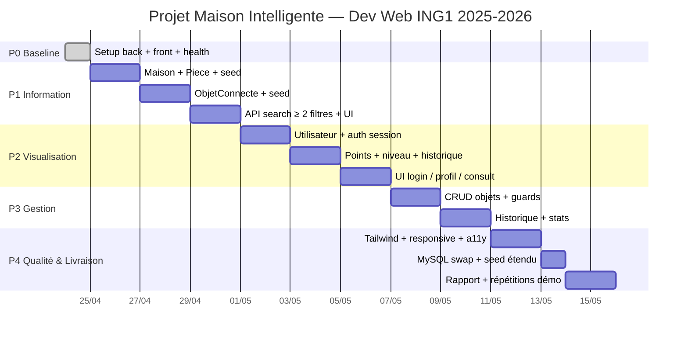

# PLAN.md — Maison Intelligente (Dev Web ING1)

Plan d'exécution MVP. Complément de [NEXT_TASKS.md](NEXT_TASKS.md) (backlog roulant) et [DECISIONS.md](DECISIONS.md) (décisions figées).

## Objectif

Livrer une démo fonctionnelle des **3 modules** (Information / Visualisation / Gestion) + rapport + soutenance, dans l'ordre MVP imposé, avec un Gantt réutilisable dans le rapport.

Administration **hors scope** (correction prof).

## Règles de travail

- Chaque tâche ≤ 2h et a une **Definition of Done (DoD)** testable (curl ou navigateur).
- Un commit par tâche DoD-verte. Pas de WIP sur `main`.
- Mise à jour de [WORKLOG.md](WORKLOG.md) après chaque tâche verte.
- Pas de sur-ingénierie : pas de JWT si session suffit, pas de Tailwind avant P4 si CSS de base suffit, pas d'abstraction prématurée.
- Le suivi du projet est centralisé via [NEXT_TASKS.md](NEXT_TASKS.md).

## Jalons

| ID | Jalon | Contenu | Statut |
|----|-------|---------|--------|
| M0 | Baseline Green | Back + Front démarrent, `/api/health` OK | done 2026-04-24 |
| M1 | Information publique | Home + recherche ≥ 2 filtres | à faire |
| M2 | Visualisation | Auth + profil + consult + points | à faire |
| M3 | Gestion | CRUD objets + stats + historique | à faire |
| M4 | Qualité & Livraison | Tailwind + responsive + WCAG + MySQL + rapport | à faire |

## Ordre d'implémentation des entités JPA

Ordre = couche la plus basse d'abord, pour que chaque entité ait déjà ses dépendances.

1. **Maison** (racine, sans parent) → 1 seule instance en pratique.
2. **Piece** (abstraite) + 6 concrètes `Salon / Chambre / Cuisine / SalleDeBain / Toilettes / Garage` → FK vers Maison.
3. **Utilisateur** (abstrait) + 3 concrets `Enfant / ParentFamille / VoisinVisiteur`. Enums : `Niveau`, `NiveauMax`, `TypeMembre`.
4. **ObjetConnecte** (abstrait) + 4 branches abstraites (`Ouvrant / Capteur / Appareil / BesoinAnimal`) + feuilles (`Volet`, `Porte`, `Thermostat`, `LaveLinge`, ...). FK vers Piece.
5. **HistoriqueAction** → FK Utilisateur + FK ObjetConnecte.
6. **DonneeCapteur** → FK ObjetConnecte (sémantiquement lié au sous-arbre Capteur, mais FK simple suffit pour MVP).

### Stratégie JPA d'héritage (proposition)

- `Piece`, `Utilisateur`, `ObjetConnecte` : **`InheritanceType.SINGLE_TABLE` + `@DiscriminatorColumn`**.
- Avantages : un seul SELECT pour les listings (module Information), code simple, perf OK au volume démo.
- Changement possible plus tard sans casser l'API REST.

## P1 — Module Information (public, pas d'auth)

**Objectif** : un visiteur peut consulter la maison et chercher des objets/pièces avec **≥ 2 filtres**.

### Backend
- [ ] **P1.1** Entités `Maison` + `Piece` + `PieceRepository` + seed 1 maison / 6 pièces — *DoD : `GET /api/info/pieces` renvoie 6 pièces.*
- [ ] **P1.2** Entités `ObjetConnecte` et sous-types (au moins 2 feuilles par branche pour démarrer) + seed ≥ 12 objets répartis — *DoD : `GET /api/info/objets` renvoie ≥ 12 items.*
- [ ] **P1.3** `InfoController.GET /api/info/objets?type=X&pieceId=Y&q=Z` (filtres combinables, tous optionnels) — *DoD : 3 requêtes curl distinctes renvoient des sous-ensembles cohérents.*
- [ ] **P1.4** DTOs de sortie (éviter sérialisation circulaire FK).

### Frontend
- [ ] **P1.5** Install `react-router-dom` + layout (Header / Main / Footer).
- [ ] **P1.6** Page `/` publique (présentation + CTA "Découvrir").
- [ ] **P1.7** Page `/recherche` : 3 filtres (type, pièce, mot-clé) + liste résultats — *DoD : combiner 2 filtres restreint la liste côté UI, debounce sur le texte.*

## P2 — Module Visualisation (membre connecté)

**Objectif** : un membre se connecte, voit son profil, consulte objets/services, ses actions alimentent points + niveau.

### Backend
- [ ] **P2.1** Hiérarchie `Utilisateur` + enums + `UtilisateurRepository` + seed 3–5 users test.
- [ ] **P2.2** Auth **session Spring Security** (cookie stateful) — pas de JWT (décision MVP, cf. Risques).
- [ ] **P2.3** `POST /api/auth/register`, `POST /api/auth/login`, `POST /api/auth/logout`, `GET /api/me`.
- [ ] **P2.4** Entité `HistoriqueAction` + service `PointsService.record(user, action)`.
- [ ] **P2.5** Règles :
  - login → +0.25 pts
  - consult → +0.50 pts
  - recalcul niveau après chaque action, clampé à `niveauMax` du type de membre
- [ ] **P2.6** `GET /api/visu/objets` (mêmes filtres que P1) + `GET /api/visu/objets/:id` qui **incrémente** l'historique.

### Frontend
- [ ] **P2.7** Pages `/login` et `/register`.
- [ ] **P2.8** Contexte Auth React + route guard (redirige non-connectés).
- [ ] **P2.9** Page `/profil` (champs publics + privés, nbConnexions, points, niveau, barre progression).
- [ ] **P2.10** Page `/objets/:id` → consulte backend (qui ajoute +0.50 et log).
- [ ] **P2.11** Badge niveau + compteur points dans le header.

## P3 — Module Gestion (réservé niveau Avancé)

**Objectif** : un parent (niveau Avancé) gère les objets, voit historique + stats.

### Backend
- [ ] **P3.1** Garde d'accès : seuls les utilisateurs avec `niveau == AVANCE` accèdent à `/api/gestion/**`.
- [ ] **P3.2** CRUD `ObjetConnecte` : `POST / PUT / DELETE /api/gestion/objets` avec un champ `type` sur le body (factory côté service pour instancier la bonne feuille).
- [ ] **P3.3** `PATCH /api/gestion/objets/:id/piece` (changement de pièce).
- [ ] **P3.4** `POST /api/gestion/objets/:id/activer` et `/desactiver` (logué dans `HistoriqueAction`).
- [ ] **P3.5** `GET /api/gestion/stats` (nb objets par pièce, nb actions 7 derniers jours) + `GET /api/gestion/historique?userId=?&objetId=?&from=?`.

### Frontend
- [ ] **P3.6** Page `/gestion/objets` (liste + actions inline activer/désactiver/supprimer).
- [ ] **P3.7** Formulaire create/edit objet (select type, marque, pièce, etc.).
- [ ] **P3.8** Page `/gestion/historique` (table filtrable).
- [ ] **P3.9** Page `/gestion/stats` (2–3 cartes + 1 graphique simple — lib `recharts`).

## P4 — Qualité & Livraison

- [ ] **P4.1** Install Tailwind + passe visuelle (bouton/form/card unifiés).
- [ ] **P4.2** Responsive pass sur 320 / 768 / 1280 px.
- [ ] **P4.3** Accessibilité (labels form, `alt`, contraste ≥ AA, navigation clavier, `aria-live` déjà en place sur health).
- [ ] **P4.4** Seed étendu (style Faker-en-Java) : ≥ 12 objets, ≥ 50 `DonneeCapteur`, ≥ 30 `HistoriqueAction`, 3–5 users.
- [ ] **P4.5** Swap H2 → MySQL (décommenter `pom.xml` + bascule `application.properties`, déjà prêts).
- [ ] **P4.6** Rédaction rapport (15 p max) : intro, Gantt (recycler celui d'ici), étapes, conclusion.
- [ ] **P4.7** 2 répétitions de démo chronométrées (soutenance = 20 min).

## Décisions en attente (à figer en groupe)

| Sujet | Proposition par défaut | Statut |
|-------|------------------------|--------|
| Seuils points | 0–3 Débutant / 3–10 Intermédiaire / ≥ 10 Avancé | à valider |
| Stratégie JPA héritage | SINGLE_TABLE partout | à valider |
| Auth | Session Spring Security (pas JWT) | à valider |
| Moment Tailwind | Installer au P4 | à valider |
| Moment MySQL | Swap à la fin P2 | à valider |
| Feuilles ObjetConnecte à implémenter au MVP | 2–3 par branche (8–12 feuilles total) | à valider |

Quand une décision est figée, la déplacer dans [DECISIONS.md](DECISIONS.md).

## Risques & mitigations

1. **Volume d'entités** (~35 feuilles si tout est implémenté). → Commencer avec 2–3 feuilles par branche, ajouter au seed si temps.
2. **Auth Spring Security chronophage**. → Session cookie stateful, pas de JWT, pas d'OAuth.
3. **UI incohérente sans framework CSS**. → Structure sémantique HTML propre dès P1, unification Tailwind en P4.
4. **Swap MySQL casse quelque chose**. → H2 déjà en `MODE=MySQL`, scripts de migration testés avant la bascule.
5. **Dérive temporelle sur le rapport**. → Tenir le Gantt ci-dessous, l'intégrer progressivement dans le rapport (pas de big-bang final).

## Gantt



Dates indicatives (base 2026-04-24). À ajuster selon disponibilité groupe.

## Convention de commits

```
feat(p1.3): /api/info/objets search with type+piece+q filters
fix(p2.7): login form submit case
chore(p4.5): switch H2 to MySQL
docs: update PLAN.md gantt dates
```

Préfixe `p<n>.<m>` = référence à la tâche dans ce plan, pour traçabilité jusqu'au rapport.
